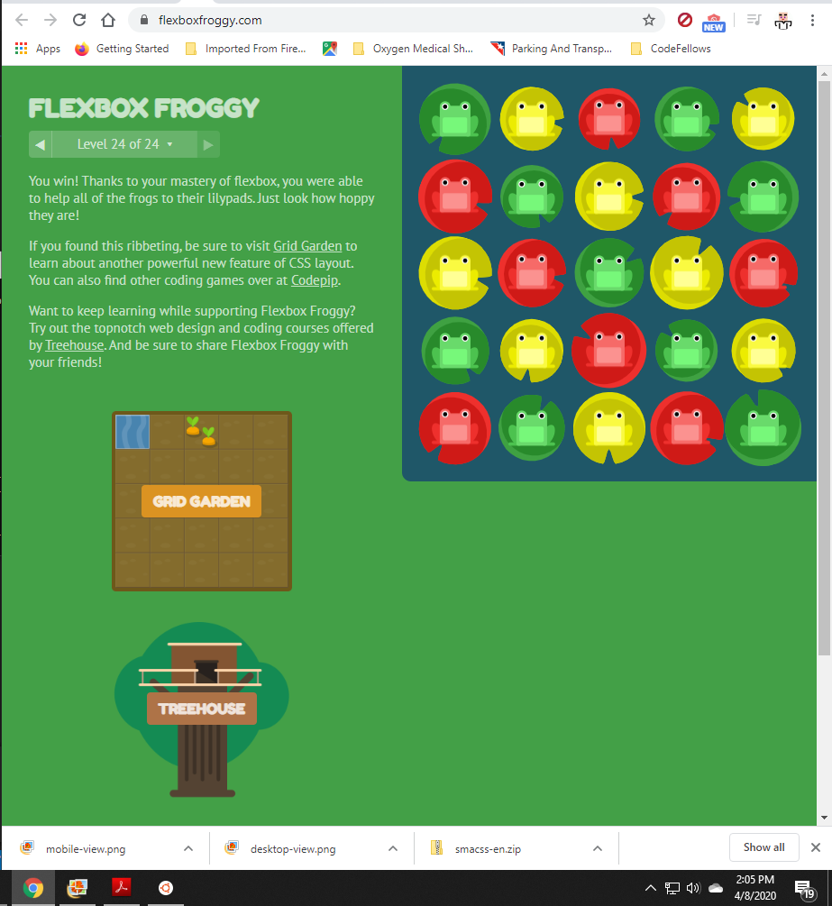

# Readings-Notes-Repository

## Class 03 notes for my Readings in Code Fellows 301 Course

[README.md](Back To Main)


## Flex

### Reading
#### [Templating with Mustache](https://medium.com/@1sherlynn/javascript-templating-language-and-engine-mustache-js-with-node-and-express-f4c2530e73b2)
* Quick and efficient 
* Uses a JSON data source
* Template is HTML markup
* > Mustache is a logic-less template syntax
    * Is logic-less due to lacking ```if``` statements, ```else``` clauses, or ```for``` loops
    * Only uses tags
        * > Some tags are replaced with a value, some nothing, and others a series of values
    * Mustache supports many languages
    * **Example:** > ```Mustache.render(“Hello, {{name}}”, { name: “Sherlynn” });```
    ```// returns: Hello, Sherlynn```
    This is important enough to quote:
    > In the above, we see two braces around {{ name }}. This is Mustache syntax to show that it is a placeholder. When Mustache compiles this, it will look for the ‘name’ property in the object we pass in, and replace {{ name }} with the actual value, e,g, “Sherlynn”.
    * Is NOT templating engine, IS a _specification_ for templating language
    * [click here to see diagram at source](https://miro.medium.com/max/1400/1*LbqYj87xlazySm6wE0Q2lA.png)
* mustache-express works with Node and Express
* Command to install with Yarn ```$ yarn add mustache-express```
* command to install with NPM (applicable to me) ```$ npm install mustache --save```
* [Click here to see image which explains configuring](https://miro.medium.com/max/1400/1*ES10lxr7tdRFVEKcRAgLEw.png)
* Actually there is a bunch of images, go to the page itself when doing this.


#### [A Guide to Flexbox](https://css-tricks.com/snippets/css/a-guide-to-flexbox/)
* This is a complete guide to Flexbox
* USE THIS!
* Existed since 2017
* Basic idea is giving the contain the power to change its contents' width/height/order to best fill available space
* > A flex container expands items to fill available free space or shrinks them to prevent overflow
    * This is their disclaimer
    > **Note:** Flexbox layout is most appropriate to the components of an application, and small-scale layouts, while the Grid layout is intended for larger scale layouts.
* ```display: flex``` This is what defines a flex container. Whether inline or block depending on the value. All its direct children get flex context. CSS columns don't affect a flex container
* ```order: <integer>;``` allows control of the order of flex items
* ```flex-direction: <value>;``` allows control of main axis for the direction of flex items

#### [Flexbox Froggy](https://flexboxfroggy.com/)
##### justify-content
* > flex-start: Items align to the left side of the container.
* > flex-end: Items align to the right side of the container.
* > center: Items align at the center of the container.
* > space-between: Items display with equal spacing between them.
* > space-around: Items display with equal spacing around them.

##### align-items
* > flex-start: Items align to the top of the container.
* > flex-end: Items align to the bottom of the container.
* > center: Items align at the vertical center of the container.
* > baseline: Items display at the baseline of the container.
* > stretch: Items are stretched to fit the container.

##### flex-direction
* > row: Items are placed the same as the text direction.
* > row-reverse: Items are placed opposite to the text direction.
* > column: Items are placed top to bottom.
* > column-reverse: Items are placed bottom to top.


##### flex-wrap
* > nowrap: Every item is fit to a single line.
* > wrap: Items wrap around to additional lines.
* > wrap-reverse: Items wrap around to additional lines in reverse.

#### flex-flow: row wrap  example

#### align-content
* > flex-start: Lines are packed at the top of the container.
* > flex-end: Lines are packed at the bottom of the container.
* > center: Lines are packed at the vertical center of the container.
* > space-between: Lines display with equal spacing between them.
* > space-around: Lines display with equal spacing around them.
* > stretch: Lines are stretched to fit the container.




### Bookmark/Skim
Reference: [Mustache.js Official Documentation](https://github.com/janl/mustache.js)