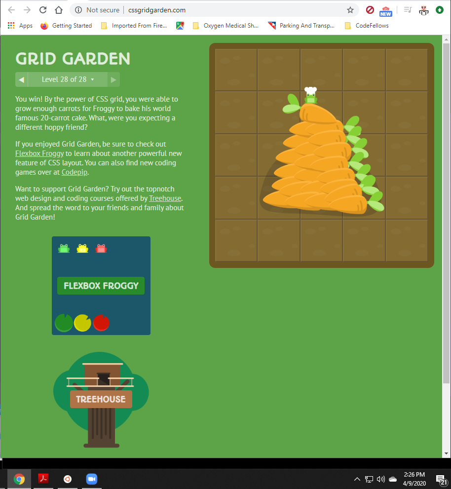

# Readings-Notes-Repository

## Class 01 notes for my Readings in Code Fellows 301 Course

[Back to Main](https://matthewadamstewart.github.io/readings-notes-repository/)

### Reading
#### CSS Grid Garden

#### Bookmark/Skim
[RegExr - Pay particular attention to the cheatsheet](https://regexr.com/)

[Regex Tutorial](https://medium.com/factory-mind/regex-tutorial-a-simple-cheatsheet-by-examples-649dc1c3f285)

[Regex 101](https://regex101.com/)

[CSS Grid Reference](https://css-tricks.com/snippets/css/complete-guide-grid/)

[Responsive design with CSS Grid](https://css-tricks.com/snippets/css/complete-guide-grid/)