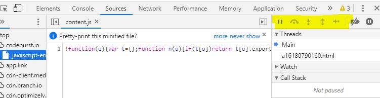

# Readings-Notes-Repository

## Class 10 notes for my Readings in Code Fellows 301 Course

[Back To Main](https://matthewadamstewart.github.io/readings-notes-repository/)

### Reading
[The Call Stack defined on MDN](https://developer.mozilla.org/en-US/docs/Glossary/Call_stack)

* > A call stack is a mechanism for an interpreter to keep track of its place in a script that calls multiple functions 
    *  The Call stack adds functions as a list which figuratively "stacking up" like a deck of cards and just like a deck of cards would be pulled out in that order

[Understanding the JavaScript Call Stack](https://medium.freecodecamp.org/understanding-the-javascript-call-stack-861e41ae61d4)

* Explains that a Call Stack allows understanding
    * > function hierarchy and execution order
* A Call Stack is a Data Structure where data is run one at a time in Last In, First Out (LIFO) order
* It is like dealing out the cards (functions)in the order they are invoked and when reaching an end of a chain tapping them fram the last set down until you get to a branch which starts a new chain and dowing that until you've layed out all the cards and tapped them to the base of the tree (first card set down)
* stack overflow is cause by a recursive function (functions which call themselves or two functions which call each other in a loop) because it creates a loop without an endpoint as far as the stack is concerned

[JavaScript error messages](https://codeburst.io/javascript-error-messages-debugging-d23f84f0ae7c)

* Properly handling errors is important
* Unhandled Error are not helpful for troubleshooting
* Error Types
    * Reference errors
    * Syntax errors
    * Range errors
    * Type errors
* Debugging
    * console.log is a common way to do this
    * Using Node.js with Visual Studio Code has a debug tab
* Call Stack, going through the console  

Additional Resources
[JavaScript errors reference on MDN](https://developer.mozilla.org/en-US/docs/Web/JavaScript/Reference/Errors)