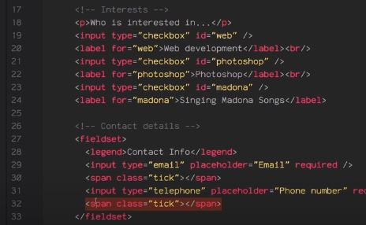
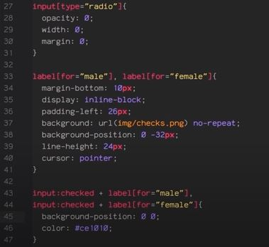
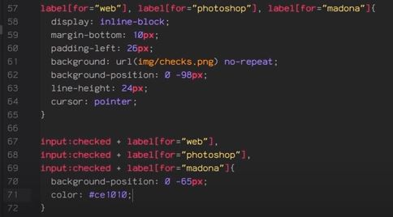
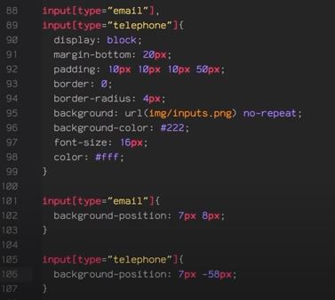
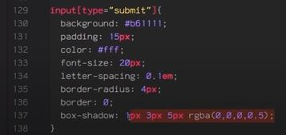
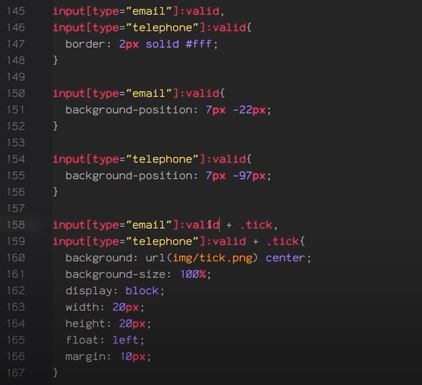

# Readings-Notes-Repository

## Class 13 notes for my Readings in Code Fellows 301 Course

[Back To Main](https://matthewadamstewart.github.io/readings-notes-repository/)


### Reading
[Sending Form Data](https://developer.mozilla.org/en-US/docs/Learn/HTML/Forms/Sending_and_retrieving_form_data)

#### Introduction
* lets us know we need basic HTML and CSS to understand
* Tells us about repo for [these lessons](https://github.com/iamshaunjp/styling-html5-forms-playlist)
* Encourages us to clone and work along
* Tells us about [Atom editor](https://atom.io/)
* This is about making forms look awesome and to fit the needs of the website
* Atom looks a bit like vscode
* Explains that the ```for``` in the label needs to match the ```id``` of the input it is for
* explains ```fieldset``` inputs (like type ```email``` type ```telephone``` and legend for a set of fields)
* Example Picture 

* explains that what he'll cover in the next 6 videos
* Shows basic CSS for the visibility and alignment for ```body```, ``` header```, ```form```
 

### Styling Radio Buttons
* Default is simple circles with dots
* Can hide via making selector ```input[type="radio] { opacity 0;, width 0; margin 0; }
* This is to make room for own image sprite to replace them to make it custom. The sprite works via displaying a position of the background image to reflect the conditional styling as explained below
* Example of code line 33:  
  
* uses condition styling based on whether input is checked (line 43 and 44)

* The sprite is a PNG file with strip of shapes with different states at different points in the hieght of the strip see this checks.png image:  


### Styling Chekboxes
* Same as above but targets different inputs types and different portion of the checks.png image meaning that he reuses the same image for both purposes, just selected different background positions
* Example of code  


* there was a bit more fiddling with spacing like line hieght
* Still checking for the input is checked for the particular labels for the conditional CSS styling shifting the position of the sprite to display the portion that reflects being checked

### Styling Text Inputs
* Styles the ```fieldset``` element and ```legend``` to make it match
* Using the type of input to target again
* Makes some aesthetic choices, and points out that display block is handy for making fields display in a column 
* adds background images to fields
* Example of code  

 

### Styling Select Boxes
* Browsers choose their own default way to style select boxes, to stripe that:
* ```select { appearance: none}```
* Needs done for various be browser support by adding these prefix in front of the above:
* ```-webkit-``` for webkit, ```-moz-``` for mozilla, ```-o-``` for opera, plus one with prefix
* adds background image to select element
* Makes many aesthetic choices, and points




### Styling by Validation
* adding ```required``` for fields with email type or telephone type has the browser verify whether what is entered matches the correct type ie tell if it is an email or phone number
* we can conditionally CSS based one the psuedoclass of whether it is ```:valid``` or ```:invalid```
* This allows cool stuff like outlining or highlighing correct input or making incorrect input red or something like that



Additional Resources

### HTML5 Forms Reference
Pay special attention to the “action” and “method” attributes.
#### Videos
[Video Series on Styling HTML5 Forms](https://www.youtube.com/playlist?list=PL4cUxeGkcC9g5_p_BVUGWykHfqx6bb7qK)


